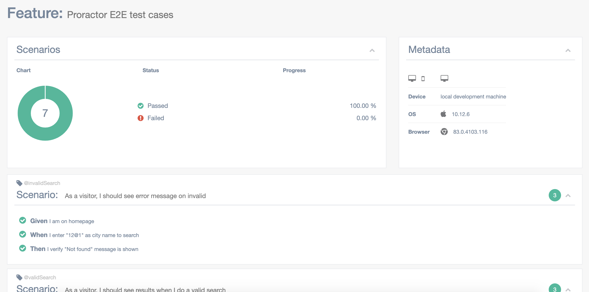

## Typescript cucumber protractor

[](https://travis-ci.com/johncena123456/typescript-protractor-cucmber)


Install Protractor globally using the command ***npm install protractor –g** or 
use the command ***npm install protractor** for a particular project.

To check if you have correctly installed it, use the command ***protractor --version**
```
Protractor installs Selenium webdriver manager with it, update Selenium webdriver manager with command webdriver-manager update.
```

To run,
1) clone the project
2) **npm i** : install dependancies
3) **npm run update-server** : update the webdriver-manageer
4) **npm run start-server** : start webdriver-manager
5) **npm run test** : to run test (executes in Chrome browser)
    for multi browser:
   **npm run multi-browser** : executes in Chrome and Firefox browser

## To start with Protractor

Create a test named folder in your project directory.
Create Config file conf.js to define two things in it:
```
seleniumAddress: Address of Selenium webdriver manager.
specs: Our test case file, which should be run.
```
So our conf.js would look something like this:

```javascript
SomeNameconf.js

exports.config = {
    seleniumAddress: 'http://localhost:4444/wd/hub',
    specs: ['spec.js']
};
```

Can be configured to run against multiple browsers

```javascript
exports.config = {
    seleniumAddress: 'http://localhost:4444/wd/hub',
    specs: ['spec.js'],
    multiCapabilities: [{
        browser: 'chrome'
    }, {
        browser: 'firefox'
    }]
};
```

## Reports

